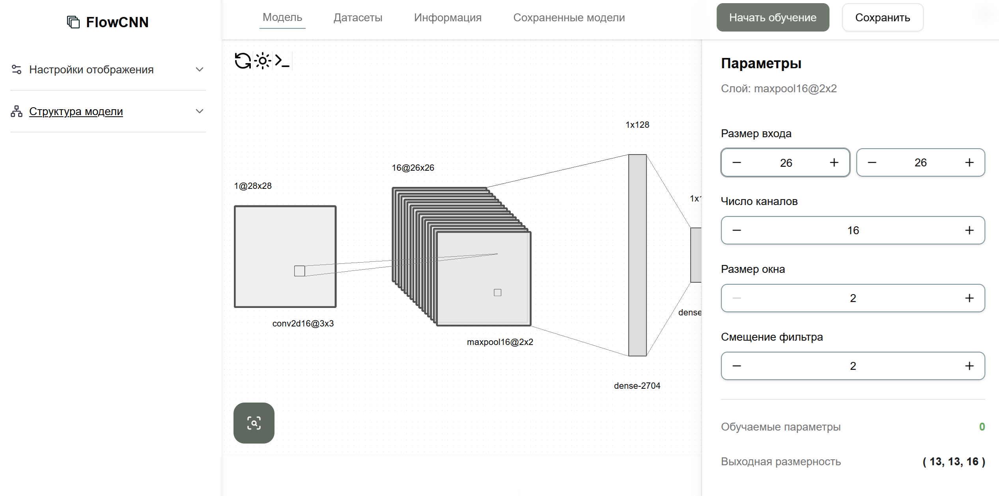

<p align="center">
  
</p>

# FlowCNN

The interactive canvas editor for convolutional neural networks, with a visualization of the architecture and control over the parameters.

## Getting Started

**The website is avaliable at:** [https://flow-cnn.vercel.app](https://flow-cnn.vercel.app)

### Local Setup

```bash
git clone https://github.com/sv022/convolution-visual.git
cd convolution-visual
yarn install
yarn run dev
```

## License

[](https://opensource.org/licenses/MIT)
<br>© 2026 [sv022](https://github.com/sv022)
